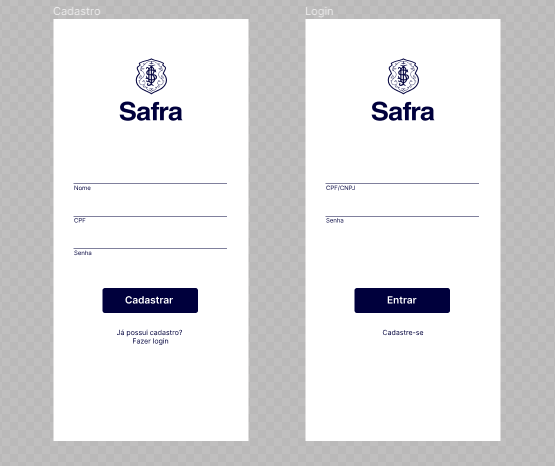
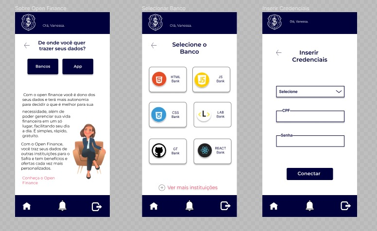
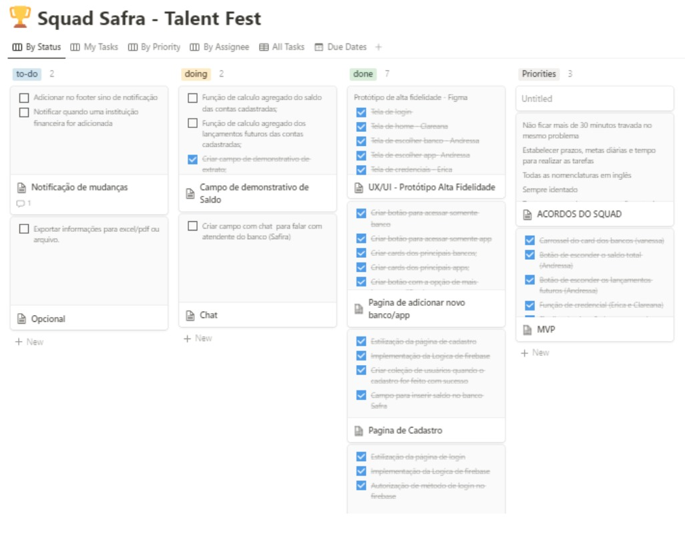

# Índice

* [1. Talent Fest](#1-talent-fest)
* [2. Safra](#2-safra)
* [3. Desafio](#3-desafio)
* [4. Historias do usuário](#4-historias-do-usuário)
* [5. Interface do usuário](#5-interface-do-usuário)
* [6. Safira](#6-safira)
* [7. Planejamento](#7-planejamento)
* [8. Code Reviews](#8-code-reviews)
* [9. Firebase e Firestore](#9-firebase-e-firestore)
* [10. Desenvolvedoras](#10-desenvolvedoras)

## 1. Talent Fest

O Talent Fest é um hackathon organizado pela Laboratória para conectar as alunas às empresas da área de tecnologia. As alunas são desafiadas pelas empresas e tem a oportunidade de demonstrarem todo o seu potencial, criatividade, talento e conhecimentos técnicos e sócio-emocionais adquiridos ao longo do bootcamp.

## 2. Safra

Um banco completo com 180 anos de tradição que oferece uma variedade de produtos e serviços financeiros. Está presente nos Estados Unidos, Caribe, América Latina, Europa, Oriente Médio e Ásia e em mais de 160 cidades ao redor do mundo. 

## 3. Desafio

O desafio consiste em criar uma aplicação com a interface do serviço de open finance, onde o usuário possa visualizar informações financeiras das demais contas correntes, contas poupança, investimentos, que possua, em um só lugar, no aplicativo do Safra, e assim facilitar o dia a dia e gerenciar a sua vida financeira. A aplicação deve ser moderna, fluida, e simplificada.

## 4. Histórias do usuário

História do usuário 1: 
"Como cliente Safra, quero ter a opção de visualizar no meu aplicativo do Safra, informação de saldo disponível de outras contas correntes, conta poupança e investimentos de outras instituições financeiras para melhor gestão da minha vida financeira.”

História do usuário 2: 
"Como cliente Safra, quero ter a opção de visualizar no meu aplicativo do Safra, informação de pendências, lançamentos futuros de outras contas correntes, conta poupança e investimentos de outras instituições financeiras para melhor gestão da minha vida financeira.”

História do usuário 3: 
"Como cliente Safra, quero ter a opção de visualizar o saldo total disponível em todas as minhas contas correntes, poupança ou investimentos de diversas instituições financeiras.”

História do usuário 4: 
"Como cliente Safra, quero ter a opção de visualizar no meu aplicativo do Safra, outros aplicativos iniciadores de pagamentos de minha preferência para melhor gestão da minha vida financeira.”

História do usuário 5: 
"Como cliente Safra, quero ser notificado caso ocorra alguma mudança (inclusão ou exclusão de algum apps de banco ou outros apps no serviço de open finance) do meu aplicativo do Safra."

História do usuário 6:
“Como cliente Safra gostaria de ter a opção de buscar e incluir no serviço de open finance, outros apps de bancos ou outros apps além dos já sugeridos no app do Safra para incluir no Open Finance."

## 5. Interface do Usuário

Os protótipos foram desenvolvidos no Figma.

Protótipo de baixa fidelidade
 

Protótipo de alta fidelidade / mobile first

 

 

Paleta de cores:
A paleta de cores foi definida de acordo com as cores já utilizadas pelo banco Safra, respeitando sua identificação visual.

O layout foi desenvolvido para ser intuitivo, simples, moderno e fluido, para oferecer a melhor experiência possível para o usuário.

## 6. Safira  

Trouxemos uma proposta de inovação com a criação da simpática atendente virtual do Safra, a Safira, com o objetivo de criar um vínculo e humanizar a experiência digital do cliente com a marca, além de oferecer informações e esclarecimentos importantes a respeito dos serviços de open finance.

 

## 7. Planejamento

O planejamento foi realizado utilizando a metologia ágil (SCRUM) e Kanban, sendo a ferramenta escolhida o Notion.

Todos os dias, realizamos dailys com toda a equipe para analisar o que foi desenvolvido no dia anterior e o que seria desenvolvido no dia presente, identificar problemas e realizar ajustes necessários, sempre definindo prioridades e focando no MVP (Produto Mínimo Viável), já que o prazo para entrega do desafio foi de apenas 3 dias. Foi desenvolvido um trabalho colaborativo, respeitoso e empático em equipe para se conseguir atingir um bom resultado final.

 

## 8. Code Reviews

Foram realizados pela equipe code reviews periodicos conforme o desenvolvimento do projeto.

## 9. Firebase e Firestore

Utilizamos o Firebase (Authentication) para as funcionalidades de cadastro de novos usuários e login no aplicativo. E o Firestore (Database) para criação de um banco de dados simulando os dados bancários dos usuários a serem disponibilizados no aplicativo após o usuário credenciar instituições financeiras na aplicação.

## 10. Desenvolvedoras

O projeto foi desenvolvido por:

* Andressa Oliveira [LinkedIn]( https://www.linkedin.com/in/andressa-oliveira-front-end/) 
* Clareana Ribeiro [LinkedIn](https://www.linkedin.com/in/clareanaribeiro/)
* Erica Lopes [LinkedIn](https://www.linkedin.com/in/blericalopes/)
* Sabrina Mariano [Linkedin](https://www.linkedin.com/in/sabrina-dias-mariano/)
* Vanessa Bueck [Linkedin](https://www.linkedin.com/in/vanessa-bueck/)
